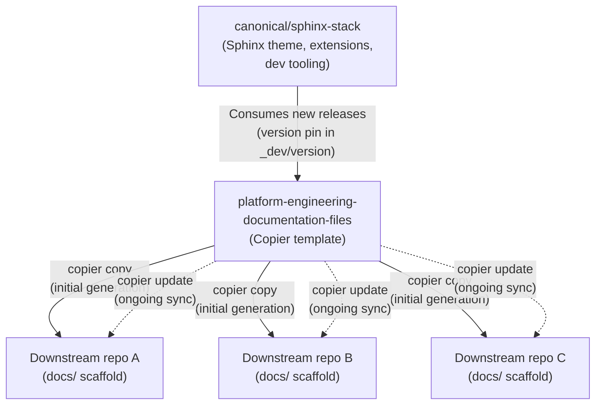

# Solution update lifecycle

This page describes how updates flow through the entire chain: from the
upstream Canonical Sphinx stack, through this Copier template, and into
downstream repositories.

## Overview

## Stage 1: sphinx-stack → this repository

The [canonical/sphinx-stack](https://github.com/canonical/sphinx-stack)
repository provides the Canonical Sphinx theme, curated extensions, and
developer tooling (vale, pa11y, pre-commit, pymarkdown).

This template consumes sphinx-stack as a dependency. The sphinx-stack version
is pinned in `template/docs/_dev/version`. When a new version of sphinx-stack
is released:

1. The version pin in this repository is updated.
2. Any template files that reference sphinx-stack tooling are updated if needed.
3. The change is committed to this repository's default branch.

## Stage 2: This repository → downstream repos

Downstream repositories consume this template in two ways:

### Initial generation (`copier copy`)

When a downstream repo first onboards, `copier copy` generates the full
documentation scaffold. The downstream repo's `.copier-answers.yml` records
the template commit that was used, enabling future updates.

### Ongoing updates (`copier update`)

When this template repository is updated, downstream repos run `copier update`
to pull in the changes. Copier compares the template commit recorded in
`.copier-answers.yml` against the current template and applies the diff.

Downstream repos can trigger updates:

- **Manually**: Run `copier update` from the repo root.
- **Automatically**: Use the callable GitHub Actions workflow (see
  [How to update a downstream repository](../how-to/update-downstream-repo.md)).

## Compatibility guarantees

| Change type | Impact on downstream | Mitigation |
|---|---|---|
| New static file added | Copied into downstream on next update | None needed |
| Static file modified | Overwritten on next update | Review diff before committing |
| New Copier variable added | Prompted during next `copier update` | Default values ensure backward compatibility |
| Copier variable removed | No longer prompted; existing answers ignored | Variable removal is avoided unless necessary |
| Templated file restructured | Re-rendered with existing answers | Review diff for conflicts |

### Breaking changes

Breaking changes are rare and handled deliberately:

1. **Deprecation notice**: The change is announced in this repository's release
   notes or changelog before it takes effect.
2. **Migration path**: Where possible, a migration script or manual steps are
   provided.
3. **Communication**: Downstream repo maintainers are notified via the
   automated update PRs or direct communication.

## Versioning

This repository does not use semantic versioning tags. Instead:

- The default branch (`main`) is the single source of truth.
- Each commit is a potential update for downstream repos.
- Downstream repos track the template commit they last synced from via
  `_commit` in `.copier-answers.yml`.
- The sphinx-stack version is tracked separately in `template/docs/_dev/version`.
