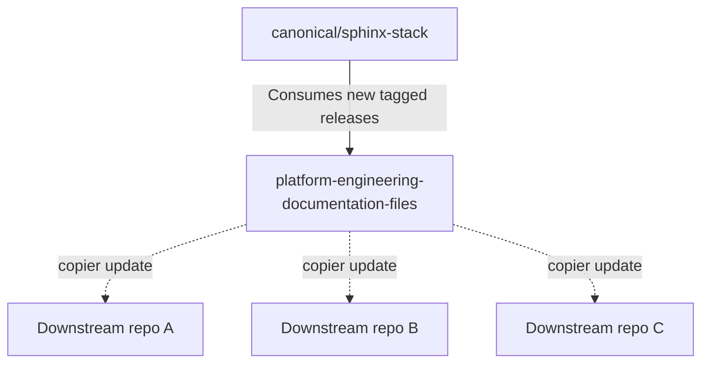

# Update lifecycle

This solution uses [`canonical/sphinx-stack`](https://github.com/canonical/sphinx-stack)
as a source of truth for the majority of its files. When the Sphinx Stack releases a new
update, this solution must ensure that the update propagates downstream while
gatekeeping breaking changes.

The downstream repositories using this solution apply the standard structure and theming of the Canonical Sphinx Stack.
The current `sphinx-stack` version used by this solution
is pinned in [`template/.sphinx-stack-version`](../../template/.sphinx-stack-version).
Upon a new tagged release of `sphinx-stack`, an automated scheduled workflow updates any
affected files used in this solution, bumping `.sphinx-stack-version` in the process. 

A downstream repository manages its updates using `copier update` to pull in the changes.
This solution contains a callable workflow to automatically detect and propagate the update.

> See also:
  [How to update a downstream repository](../how-to/update-downstream-repo.md)

